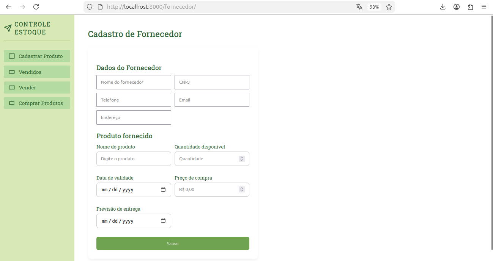

# 📦 Projeto: Controle de Estoque

O projeto Controle de Estoque foi desenvolvido na disciplina de Desenvolvimento Web com o objetivo de aplicar, na prática, os conceitos estudados tanto no frontend quanto no backend.

# 🎯 Objetivo do Sistema

O sistema foi projetado para permitir o gerenciamento completo de:

Fornecedores
Produtos
Estoque
Clientes
Vendas

# 🧱 Tecnologias Utilizadas
## 🔹 Frontend
HTML: Estruturação das páginas
CSS: Estilização e design da interface

## 🔹 Backend
Python: Linguagem principal utilizada
Django: Framework responsável pela lógica do sistema e organização da aplicação

## 🔹 Integração
APIs: Utilizadas para comunicação entre frontend e backend, garantindo organização, escalabilidade e possibilidade de integração futura

# ⚙️ Principais Funcionalidades
## 📌 Cadastro de Fornecedores e Produtos
Permite cadastrar fornecedores
Permite cadastrar produtos vinculados aos fornecedores
Representa o início do fluxo do sistema

## 🛒 Aba "Comprar Produtos"
Registra compras realizadas com fornecedores
Adiciona produtos ao estoque
Atualiza a quantidade disponível no sistema

## 💰 Aba "Vender"
Realiza vendas para clientes
Regra importante: só é possível vender produtos disponíveis no estoque

## 📊 Aba "Vendidos"
Exibe o histórico de vendas
Permite acompanhar todas as transações realizadas

# 🧠 Conceitos Aplicados
## 🔸 Models
Representam a estrutura dos dados
Definem entidades como:
Fornecedores
Produtos
Clientes
Vendas

Cada model corresponde a uma tabela no banco de dados
## 🔸 Views
Responsáveis pela lógica do sistema
Recebem requisições do usuário
Processam ações como:
Cadastro
Compra
Venda

Retornam respostas, geralmente em formato JSON
## 🔸 APIs
Fazem a comunicação entre frontend e backend
Permitem envio e processamento de dados
Tornam o sistema:
Mais organizado
Reutilizável
Escalável

# 💻 Repositório do Projeto

Acesse o projeto em:
https://github.com/AlmerindaEstudo/projeto-djando-web01/tree/projetoprincipal

# ▶️ Como Executar o Projeto
## Clonar o repositório:
git clone -b projetoprincipal --single-branch https://github.com/AlmerindaEstudo/projeto-djando-web01.git

## Acessar a pasta:
cd projeto-djando-web01

## Criar ambiente virtual:
python -m venv venv

## Ativar o ambiente:
venv\Scripts\Activate

## Instalar dependências:
pip install -r requirements.txt

## Acessar o backend:
cd backend

## Rodar migrações:
python manage.py makemigrations
python manage.py migrate

## Iniciar o servidor:
python manage.py runserver
